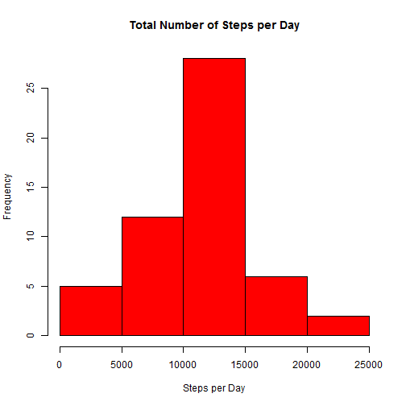
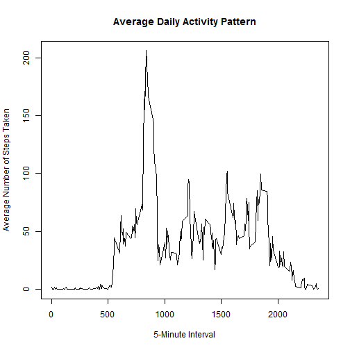
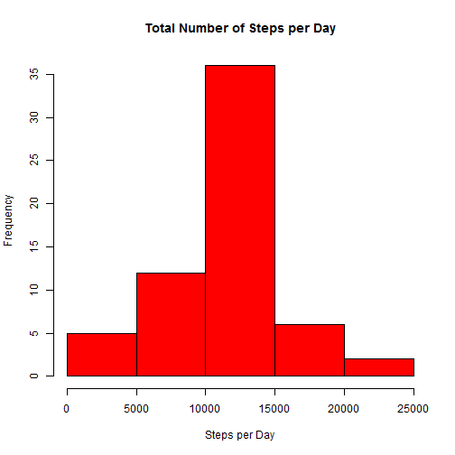

## Loading and preprocessing the data


```r
# load the activity data, converting the date column to a date type
activity <- read.csv(unz("activity.zip", "activity.csv"), colClasses=c(NA, "Date", NA))
```

## What is mean total number of steps taken per day?


```r
# calculate the total number of steps per day
stepsPerDay <- aggregate(steps ~ date, activity, sum)

# plot a histogram of the total number of steps taken each day
hist(stepsPerDay$steps, 
     main="Total Number of Steps per Day", 
     xlab="Steps per Day", col="red")
```

 


```r
# Calculate the mean and median total number of steps taken per day
meanStepsPerDay <- mean(stepsPerDay$steps)
medianStepsPerDay <- median(stepsPerDay$steps)
```

The mean total number of steps taken per day is 10766.

The median total number of steps taken per day is 10765.

## What is the average daily activity pattern?


```r
# Calculate the average number of steps taken, averaged across all days, per 5 minute interval
stepsPerInterval <- aggregate(steps ~ interval, activity, mean)

# Plot a time series of the average number of steps taken per 5 minute interval
plot(stepsPerInterval, 
     type="l", main="Average Daily Activity Pattern", 
     xlab="5-Minute Interval", ylab="Average Number of Steps Taken")
```

 


```r
# Caluclate the 5-minute interval that contains the maximum number of steps
mostActiveInterval = stepsPerInterval[which.max(stepsPerInterval$steps), ]
```

The 5-minute interval 835, on average across all the days in the dataset, contains the maximum number of steps which is 206.

## Imputing missing values


```r
# subset the rows with the missing values
missingValues <- activity[is.na(activity$steps), ]
```

The number of missing values in the dataset is 2304


```r
# replace the missing values with the average of the interval accross the other days 
missingValues <- merge(missingValues, stepsPerInterval, by="interval")

# sort the missing values again as the merging destroys the original sequence
missingValues <- missingValues[order(missingValues$date, missingValues$interval), ]

# merge the imputed missing values with the activity data set again to create a 
# data set without missing values
activity[is.na(activity$steps), "steps"] <- missingValues[, "steps.y"]
```


```r
# calculate the total number of steps per day again
stepsPerDay <- aggregate(steps ~ date, activity, sum)

# plot a histogram of the total number of steps taken each day
hist(stepsPerDay$steps, 
     main="Total Number of Steps per Day", 
     xlab="Steps per Day", col="red")
```

 


```r
# Calculate the mean and median total number of steps taken per day
meanStepsPerDay <- mean(stepsPerDay$steps)
medianStepsPerDay <- median(stepsPerDay$steps)
```

The mean total number of steps taken per day is 10766.

The median total number of steps taken per day is 10766.

## Are there differences in activity patterns between weekdays and weekends?


```r
# load the lattice package
library(lattice)

# factor the days into weekend and weekday days
activity$day.type <- as.factor(
  ifelse(weekdays(activity$date) %in% c("Saturday", "Sunday"), "Weekend", "Weekday"))

# Calculate the average number of steps taken, averaged across all days, per 5 minute interval
stepsPerIntervalPerDayType <- aggregate(steps ~ interval + day.type, activity, mean)

# Make a panel plot containing a time series of the 5-minute interval (x-axis) and the average
# number of steps taken, averaged across all weekday days or weekend days 
xyplot(steps ~ interval | day.type, 
       stepsPerIntervalPerDayType, 
       type="l", layout=c(1, 2), 
       xlab="Interval", ylab="Number of steps")
```

 


